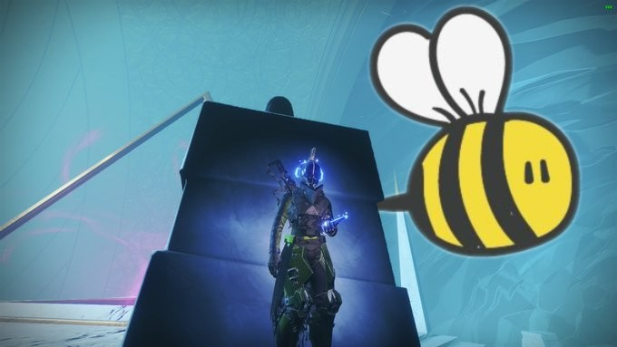

*Chilling out, listening to a podcast.*

In 2004, Bungie released an Alternate Reality Game (ARG) to help promote Halo 2's release called "I Love Bees". The game involved players interacting with a website to recieve GPS coordinates to go to specific locations and answer payphone calls to uncover more of the story. While some of the ARG's contents is still available to people - <a href="www.ilovebees.co">ilovebees.co</a> is still online and you can still listen to the rather good radio drama - a lot of the ongoing plot was transient. The experience of playing the game isn't available anymore except through other people conveying what the game was and what happened.

Bungie has always liked bleeding their games into the real world, even back in the Marathon days. There were posts from the AI on the bungie.org pages for Marathon, and even posts from Cortana for Halo 1 there. Microsoft even made another ARG for Halo 3's launch - Iris. The studio has always had a level of interactivity with it's community that was rarely seen, and the community has always deeply appreciated their efforts - just look at <a href="www.reddit.com/r/raidsecrets">/r/RaidSecrets</a>, they go rabid for that stuff.

In 2014 Bungie released Destiny, a "shared world shooter" that has maintained a large following for people who fell in love with it's Sci-fi weirdness, a mixture of technology and magic, and it's (in my personal opinion) unparalleled gameplay, where gunplay and abilities blend together in an addictive way. It's also what's known as a "Games as a Service" (GAAS) title, in which content is added to and updated on a reasonably frequent schedule. This game was successful enough over time for Bungie to then release Destiny 2 in 2017, which originally followed much the same formula - reasonably frequent content additions on a seasonal basis.

After the second year, though, this changed. In year 2 of Destiny 2, under the Forsaken expansion there were three seasons over the next year that each added an activity for players to play through and earn new equipment. In year 3 (Shadowkeep), however, there were still the activities added in each season, but once that season left so too did the activity - content added and then removed. This changed again in year 4, with all of the year 1 and a lot of the year 2 content that was added being "put in the content vault" - seemingly borrowing an idea from Disney, where they would release their animated movies on a drip feed on VHS and DVD and then stop selling them for a few year - putting the movies in the "Disney Vault". Seasonal content that is added from the start of year 4 would stay around the whole year, unlike in year 3, but still go away at the end of the year and... yeah, this gets kind of complicated.

The point is that the content in Destiny 2 is transient and a new player to the game won't have anywhere near the same experience as a player that's been there the whole time (*Destiny 1 alpha veteran here, move aside peons*). There's a lot to the game that isn't nescessarily accessible to a new player *inside* the game, even if we're just talking about plot. There's blog posts, videos from content creators that aren't Bungie's employees (<a href="https://www.youtube.com/c/MynameisByf">My Name is Byf</a> is a good place to start), reddit posts with entire discussions about puzzles, and just piles of things going on that, even if you put aside the FOMO issue that this model has, you kind of have to do a lot of legwork outside of the game just to catch up.

And that kind of feels like an ARG to me. Bungie has essentially created a game that to get the full experience you kind of have to be playing the game on a weekly basis, and keep track of what's going on in the community, and if you don't you're kind of not getting the full picture. *Alternately*, I could be talking out of my ass because *I'm* that sort of person and I can't see further than my own colon. I do love it though. Thanks, Bungo.
